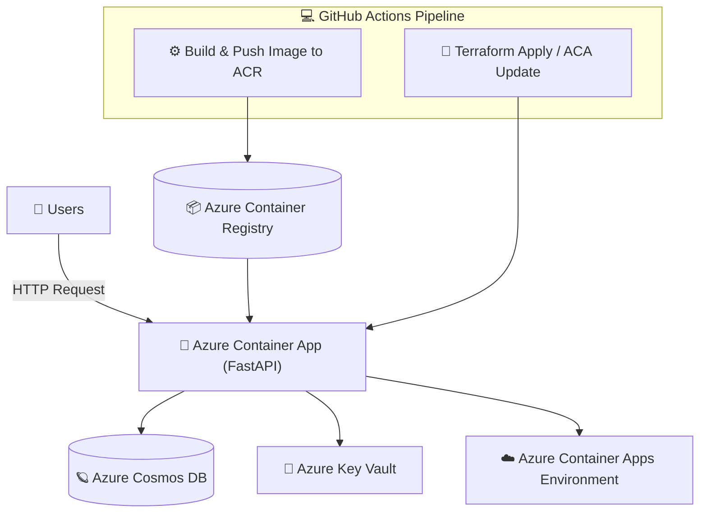

#  🐳 Azure Container Apps — Terraform & CI/CD Project

## 1️⃣ Description & Objectives

This project deploys a serverless containerized application using Azure Container Apps (ACA) with full automation through Terraform and GitHub Actions.

The goal is to build a lightweight, fully managed microservice platform without managing Kubernetes, enabling:

* Container-based deployment (FastAPI app with Cosmos DB)

* Secure networking & secret management (Key Vault integration)

* Image automation (ACR push + ACA update via pipeline)

* Scalable architecture for both development and production environments

## 2️⃣ Architecture & Deployment
### 🧱 Components

The Terraform code provisions all core Azure resources:

* Resource Group – project isolation

* Azure Container Registry (ACR) – stores Docker images

* Azure Container Apps Environment (ACA Env) – managed runtime for containers

* Azure Container App (ACA) – deploys the actual FastAPI application

* Azure Cosmos DB – NoSQL database backend

* Azure Key Vault – stores Cosmos DB secrets (endpoint, key) securely

* Managed Identities (System & User Assigned) – used for secure access to ACR and Key Vault

## 🕸️ High-Level Architecture


## ⚙️ Terraform Modules

The project follows a modular structure:

```bash

terraform-containerapp/
├── envs/
│   ├── dev/
│   │   │--infra
│   │   │  ├── main.tf
│   │   │  ├── variables.tf
│   │   │  ├── outputs.tf
│   │   │  ├── dev.tfvars
│   │   │  ├── providers.tf
│   │   │  ├── datasource.tf
│   │   │  └── backend.tf
│   │   │-- flask-app/src/
│   │   │   │-- app/
│   │   │   │   └──  main.py
│   │   │   │-- Dockerfile
└   └   └   └── requirements.txt
├── modules/
│   ├── acr/          # Azure Container Registry
│   ├── aca_env/      # Container Apps Environment
│   ├── aca_app/      # Application definition
│   ├── cosmos/       # Cosmos DB setup
│   ├── keyvault/     # Key Vault + secrets
│   ├── logenv/       # logs
│   └── rg/           # resource group
├── common/bootstrap-backend/
│   │   │  ├── main.tf
│   │   │  ├── variables.tf
│   │   │  ├── outputs.tf
└   └   └  └── provider.tf


```
## 🧩 Summary
| Component            | Description                                                     |
| -------------------- | --------------------------------------------------------------- |
| **Terraform**        | Provisions all Azure resources (ACA, ACR, Key Vault, Cosmos DB) |
| **GitHub Actions**   | Automates build, push, and deployment                           |
| **Managed Identity** | Secure ACR & Key Vault access (no secrets in code)              |
| **Azure Key Vault**  | Centralized secret storage                                      |
| **Cosmos DB**        | Application database                                            |
| **FastAPI App**      | Deployed container, scalable & stateless                        |


